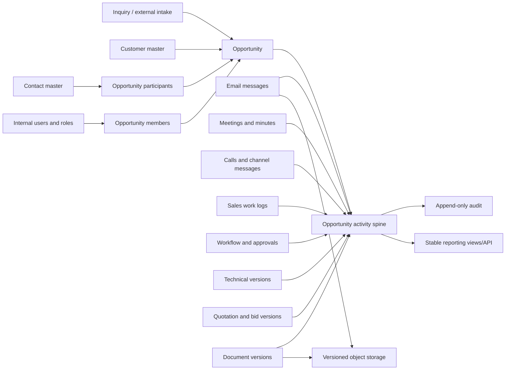

# BESTCRM Opportunity-Centered Durable Record System

- Date: 2026-09-07
- Status: Core architecture approved; recovery objectives, channel order, and private-note visibility pending
- Scope: Database and durable-record architecture only
- Deployment: None; this document does not authorize schema migration or production changes

## 1. Objective

BESTCRM shall treat the opportunity as the main business thread from qualified
inquiry through customer communication, technical and commercial work, bid,
contract, completion, loss, and archive.

The application is replaceable. The durable CRM record is the combination of:

1. PostgreSQL relational data and immutable business events.
2. Versioned binary objects for files, attachments, generated documents, and
   original email messages.
3. A documented schema, event catalogue, data dictionary, and export manifest.
4. Tested backups and a repeatable restore procedure.

A new application with a different interface must be able to reconstruct the
same customer, contact, opportunity, communication, document, approval, and
audit history without depending on the old HTML templates or route code.

## 2. Non-negotiable principles

### 2.1 Opportunity is the business aggregate root

- A qualified project has one stable opportunity identity.
- Every project email, meeting, call, message, note, task, file, technical
  submission, quotation, approval, ownership change, and outcome is linked to
  that opportunity.
- A new or unclassified inbound message may remain linked only to an inquiry
  until a Sales Manager converts it. Conversion must atomically link the whole
  existing thread and its files to the new opportunity.
- General marketing communication that does not concern a specific project may
  remain customer/contact-level data. It must never be falsely attached to an
  opportunity merely to satisfy the model.

### 2.2 Customer and contact remain master data

- Customers and contacts are not copied into each opportunity as independent
  mutable records.
- One customer and one contact can participate in many opportunities.
- The opportunity stores relational links plus historical snapshots of the
  names, addresses, roles, and communication identities used at that time.
- Later corrections to a customer or contact must not rewrite what appeared in
  an old sent quotation, email, meeting record, or approved document.

### 2.3 Business history is append-only

- Core business records are archived, superseded, merged, or corrected; they
  are not hard-deleted.
- Sent email, received email, approved material, issued quotation, signed
  contract, meeting minutes, file versions, and business events are immutable.
- A correction creates a new version or a superseding event with actor, reason,
  timestamp, and reference to the earlier record.
- User accounts are deactivated rather than deleted so historical authorship is
  retained.

### 2.4 Specialized records plus one unified activity spine

The design shall not put every business field in a single JSON table. Email,
meeting, file, quotation, and approval records retain their own normalized
tables and constraints. A common activity record supplies a stable, sortable,
permission-aware opportunity timeline.

### 2.5 Database and file store form one data vault

PostgreSQL alone cannot preserve uploaded binaries if it stores only a local
path. Every binary object must have a database record containing a stable ID,
object key, size, MIME type, SHA-256 digest, version, creator, timestamps, and
retention state. The object itself must live in versioned durable storage and be
backed up independently from the application server.

## 3. Current-state findings

The current local schema contains 46 applied migrations and 70 public tables.
It already includes customers, contacts, opportunities, workflow events, sales
work, technical revisions, quotation packages, email threads/messages,
attachments, bid workspaces, approvals, and audit-related records.

The current opportunity foreign-key delete behaviour is not yet compatible with
the new durability objective:

- 12 relationships use `ON DELETE CASCADE`.
- 5 relationships use `ON DELETE SET NULL`.
- Only 3 relationships use `ON DELETE RESTRICT`.
- The application repository currently contains a direct
  `DELETE FROM opportunities` operation.

The current sales-work design also treats plans and logs as a separate module
and explicitly excludes them from the opportunity timeline. That design remains
valid for module ownership, but the new unified activity spine will make linked
sales work visible on the opportunity without moving its write logic into the
opportunity route module.

These findings require additive migrations and backfill. They do not justify
editing or deleting existing production records.

## 4. Target architecture

### 4.1 Stable identities

Core business entities should retain the existing numeric primary keys for
compatibility and add immutable UUID public identities:

- `customers.record_uid`
- `contacts.record_uid`
- `opportunities.record_uid`
- `opportunity_activities.activity_uid`
- `documents.document_uid`
- `document_versions.version_uid`

Numeric IDs remain efficient internal keys. UUIDs make exports, integrations,
cross-system references, and future application rewrites safer.

### 4.2 Existing core tables

The following remain authoritative master/aggregate tables:

- `customers`
- `contacts`
- `opportunities`
- `users`, `roles`, `user_roles`
- `inquiries`
- `opportunity_members`

Required lifecycle additions:

- `archived_at`, `archived_by`, `archive_reason`
- `merged_into_id` for duplicate customer/contact resolution where applicable
- `record_uid`
- database triggers preventing hard deletion of protected business entities

### 4.3 Opportunity contacts

Create `opportunity_contacts` so an opportunity is not limited to one contact:

- `id`
- `opportunity_id` (`ON DELETE RESTRICT`)
- `contact_id` (`ON DELETE RESTRICT`)
- `role_code`: primary, commercial, technical, finance, legal, end_user, other
- `is_primary`
- `valid_from`, `valid_to`
- `name_snapshot`, `title_snapshot`, `email_snapshot`, `phone_snapshot`
- `created_by`, `created_at`

Enforce one current primary contact per opportunity with a partial unique index.

### 4.4 Opportunity activity spine

Create `opportunity_activities` as the canonical chronological index:

- `id`, `activity_uid`
- `opportunity_id` (`NOT NULL`, `ON DELETE RESTRICT`)
- `activity_type_code`: email, meeting, call, channel_message, note, task, file,
  workflow, approval, technical, quotation, contract, ownership, outcome
- `activity_status`: planned, active, completed, cancelled, failed, superseded
- `direction`: inbound, outbound, internal, or null
- `occurred_at`: when the business action happened
- `recorded_at`: when CRM recorded it
- `actor_user_id`, optional `owner_user_id`
- `subject`, `summary`
- `visibility_scope`: opportunity_team, management, technical, commercial,
  private_internal
- `source_system`, `source_external_key`
- `correlation_uid` for one logical transaction across multiple records
- `parent_activity_id`, optional `supersedes_activity_id`
- `snapshot_schema_version`, `snapshot_payload` (`jsonb`)
- `created_at`

Use an `activity_types` reference table with code, category, labels, payload
schema version, and active state. Do not use a PostgreSQL enum for this field;
new controlled activity types must be addable through a migration without
rewriting historical records.

Important constraints:

- Unique `(source_system, source_external_key)` when the external key exists.
- Activity identity, opportunity link, type, occurrence time, and snapshot are
  immutable after insert.
- Corrections append a new activity referencing `supersedes_activity_id`.
- Index `(opportunity_id, occurred_at DESC, id DESC)` for the main timeline.
- Indexes cover type, actor, contact participant, and external identity filters.

The JSON snapshot is supporting evidence, not a substitute for normalized
tables. It preserves the human-readable state needed for historical rendering.

### 4.5 Typed activity links

Create `opportunity_activity_links` with explicit nullable foreign keys to the
supported specialized records. One activity may have several link rows, but
each link row identifies exactly one specialized source record:

- `activity_id`
- `email_message_id`
- `meeting_id`
- `channel_message_id`
- `sales_work_log_id`
- `workflow_event_id`
- `attachment_id` or `document_version_id`
- `technical_solution_version_id`
- `quotation_package_version_id`
- `contract_approval_id`

A check constraint requires exactly one typed foreign key per link row. Unique
constraints prevent one source record from generating duplicate primary
activities. New source types are introduced through migrations and event-catalog
documentation.

### 4.6 Activity participants

Create `opportunity_activity_participants`:

- `activity_id`
- optional `user_id`
- optional `contact_id`
- `participant_role`: author, sender, to, cc, bcc, organizer, attendee,
  decision_maker, contributor
- `display_name_snapshot`
- `address_snapshot`
- `attendance_status`

This normalized table makes reporting and permission checks reliable. Existing
email recipient JSON remains immutable source evidence and is additionally
projected into participant rows.

## 5. Communication records

### 5.1 Email

Keep `email_threads`, `email_messages`, `email_attachments`, and
`email_delivery_attempts` as the authoritative email model.

Required rules:

- Each opportunity-linked message creates one activity record.
- A thread can begin at inquiry level and be linked to an opportunity by an
  audited conversion event.
- Original `.eml`, parsed body, safe headers, provider identities, recipients,
  attachments, checksums, author, and delivery attempts are retained.
- Import is archive-first: commit the CRM message and object manifest before
  advancing the mailbox checkpoint or marking provider mail as seen.
- Sending is outbox-first: commit the pending message and outbox job before
  SMTP; append delivery attempts and final provider acceptance afterward.
- Message-ID, provider UID/thread identity, and idempotency keys prevent
  duplicate import or send.

### 5.2 Meetings

Create `meetings`:

- `id`, `activity_id`, `opportunity_id`
- `meeting_type`: onsite, video, telephone, internal, customer
- `status`: planned, completed, cancelled, no_show
- `scheduled_start_at`, `scheduled_end_at`
- `actual_start_at`, `actual_end_at`
- `timezone`, `location`, `meeting_url`
- `agenda`, `minutes`, `decisions`, `customer_feedback`, `next_actions`
- `organizer_user_id`, `created_by`, timestamps

Create `meeting_participants` with user/contact identity, external display and
address snapshots, invitation state, and attendance state.

Meeting changes and minutes corrections create revisions/events. Completed
minutes are never overwritten without an auditable superseding revision.

### 5.3 Calls, WeChat, WhatsApp, and other channels

Create `channel_conversations` and `channel_messages`:

- channel/provider and connection identity
- provider conversation/message identity
- direction, sender, recipients, body, timestamps, delivery state
- raw payload object identity and SHA-256
- opportunity, customer, and contact links
- import/source metadata and idempotency key

Only official provider integrations or approved exports may ingest messages.
Failed matching enters a review queue; it must not silently attach communication
to the wrong opportunity.

## 6. Durable document model

Create `documents` as logical business-document identities and
`document_versions` as immutable binary/content versions.

### `documents`

- `id`, `document_uid`, `opportunity_id`
- `document_type`: inquiry, requirement, meeting, technical, drawing,
  quotation, bid, contract, correspondence, other
- `title`, `classification`, `current_version_id`
- creator and lifecycle timestamps

### `document_versions`

- `id`, `version_uid`, `document_id`, `version_no`
- `object_key`, `original_name`, `mime_type`, `byte_size`, `sha256`
- optional `content_sha256`, `source_system`, `source_external_key`
- `created_by`, `created_at`
- `retention_state`: active, superseded, legal_hold, expired
- generated/source/template revision references where applicable

Existing `attachments`, `email_attachments`, `technical_solution_documents`,
and `quotation_package_documents` are preserved and gradually linked to the
canonical document/version records. No destructive rewrite is required.

The database shall reject a document version that has no corresponding durable
object manifest. A reconciliation job verifies object existence, size, and hash
and reports orphans in both directions.

## 7. Workflow, technical, commercial, and contract history

- Existing specialized tables remain authoritative for business rules and
  approvals.
- Every specialized status change appends its domain event and one activity
  record in the same database transaction.
- Approved or customer-sent versions are immutable.
- Drafts can change only until submission; subsequent changes create a new
  draft/version.
- The opportunity stores explicit links to the accepted quotation package and
  resulting contract/order version.
- Sales work remains a separate module for maintainability, but any plan/log
  with `opportunity_id` is indexed into the unified opportunity activity view.

## 8. Audit and permission separation

Business timeline and security audit are related but distinct:

- The opportunity activity spine answers what happened in the business process.
- `audit_events` answers who viewed, downloaded, exported, corrected, assigned,
  or attempted an unauthorized action.

Create an append-only audit structure containing actor, action, entity type and
UID, opportunity ID where applicable, request/correlation ID, result, safe
metadata, IP/user-agent policy fields, and timestamp.

Timeline visibility is always enforced server-side. Direct URLs, exports, file
downloads, email bodies, meeting minutes, and technical/commercial documents use
the same opportunity visibility and role rules.

## 9. Delete, archive, merge, and correction policy

### Prohibited

- Direct deletion of an opportunity.
- Cascade deletion of opportunity business history.
- Nulling an opportunity link merely because an opportunity is archived.
- Replacing a sent email, issued quotation, approved document, or meeting
  minutes in place.
- Deleting a file object while a retained version references it.

### Allowed controlled operations

- Archive/reopen an opportunity with reason and actor.
- Merge duplicate customers or contacts through `merged_into_id` and a mapping
  event; retained history keeps original snapshots.
- Supersede a wrong record with an auditable correction.
- Apply a separately approved privacy/redaction workflow where law or policy
  requires it; redaction must preserve non-personal business evidence and audit.

All historical foreign keys to `opportunities` should converge on
`ON DELETE RESTRICT`. The database should also have a trigger that rejects
opportunity deletion even if an application bypasses normal service code.

## 10. Transaction and integration reliability

Create `integration_inbox` and `integration_outbox`:

- `integration_inbox` stores provider, external identity, received time, raw
  object reference/hash, processing state, attempts, and safe error.
- `integration_outbox` stores event/job type, aggregate UID, payload, state,
  attempts, next attempt, provider result, and timestamps.

Business data, its activity event, audit record, and outbox row are committed in
one PostgreSQL transaction. Workers use idempotency keys and leases. A worker or
web application crash can therefore be retried without losing or duplicating
business facts.

## 11. Stable read models for replaceable applications

Publish versioned SQL views or API read models:

- `v_opportunity_timeline_v1`
- `v_opportunity_participants_v1`
- `v_opportunity_documents_v1`
- `v_customer_360_v1`
- `v_contact_360_v1`
- `v_communication_history_v1`
- `v_opportunity_current_state_v1`

Each view has documented columns and semantics. A future CRM frontend consumes
these contracts rather than reconstructing joins differently in every page.

Maintain in the repository:

- forward-only migrations
- schema diagram and data dictionary
- event type catalogue and JSON schemas
- OpenAPI/API contract where an API is exposed
- backup/restore runbook
- export manifest format
- automated integrity and restore tests

## 12. Backup and disaster recovery

An application crash should not affect PostgreSQL or object storage. Prefer a
stateless application tier and a database service or database host independent
from the web application process.

Required protection layers:

1. PostgreSQL continuous WAL archiving for point-in-time recovery.
2. Daily database base/logical backup.
3. Versioned and immutable object storage for files and original email.
4. Encrypted backup copies outside the application server and outside its
   single failure domain.
5. Backup catalogue containing schema version, row counts, object count, total
   bytes, and manifest hashes.
6. Automatic backup verification plus scheduled full restore drills.
7. Separate, protected credentials for production writes, backups, and restores.

Proposed targets requiring business approval:

- RPO: no more than 5 minutes of committed data.
- RTO: core CRM restored within 2 hours.
- Point-in-time recovery window: 35 days.
- Daily backups: 35 days.
- Monthly backups: 12 months.
- Annual immutable archive: 7 years, subject to business/legal confirmation.
- Full restore drill: quarterly; sample opportunity reconstruction: monthly.

A seven-day cloud-disk snapshot policy is useful for short operational recovery
but is not sufficient as the only CRM retention strategy.

## 13. Recovery and rebuild acceptance test

The design is accepted only when a clean environment can:

1. Restore PostgreSQL to a selected point in time.
2. Restore or reconnect the versioned object store.
3. Verify every retained file/email object against its recorded SHA-256.
4. Apply migrations and expose the versioned read views.
5. Reconstruct a sampled opportunity including customer/contact snapshots,
   participants, emails and attachments, meetings and minutes, files and
   versions, technical/commercial materials, approvals, tasks, and outcome.
6. Start a newly built test UI against the restored data without changing the
   underlying business records.
7. Produce reconciliation evidence showing no orphan business rows, no orphan
   object manifests, and no missing retained objects.

## 14. Non-destructive migration sequence

Provisional migration names; final numbers are assigned only at implementation:

### Phase A: Guardrails

- Add stable UIDs and archive/merge metadata.
- Remove the application hard-delete path for opportunities.
- Add database no-delete triggers.
- Replace opportunity-history cascade/set-null relationships with restrict
  behaviour after dependency and data-quality checks.
- Add integrity tests before any backfill.

### Phase B: Activity spine

- Add activities, typed links, participants, event catalogue, and indexes.
- Dual-write new events while existing pages continue using current tables.
- Backfill existing workflow events, email, sales logs, files, technical data,
  quotation data, and ownership history in bounded idempotent batches.
- Compare per-source counts, IDs, timestamps, and hashes before marking complete.

### Phase C: Meetings and channel communication

- Add normalized meeting, participant, conversation, and channel-message tables.
- Add review queues for unmatched external records.
- Keep all provider adapters outside domain tables.

### Phase D: Document vault

- Create canonical document/version manifests.
- Link existing file tables without moving or deleting current objects.
- Copy to versioned durable storage, verify hashes, then switch reads behind a
  feature flag.

### Phase E: Stable read contracts and new UI

- Publish versioned views/API.
- Build the opportunity timeline from the new read contract.
- Run old and new reads in parallel and compare results.
- Only after parity may future interfaces replace current pages.

### Phase F: Recovery proof

- Restore into an isolated environment.
- Run integrity, permission, timeline, and object reconciliation tests.
- Record measured RPO/RTO and obtain business acceptance.

Each phase requires its own Git checkpoint, database backup, rollback plan,
local tests, staging verification, and explicit production approval.

## 15. Decisions required before implementation

The following are intentionally not inferred:

1. Confirm or change the proposed RPO of 5 minutes and RTO of 2 hours.
2. Confirm record retention: 7 years, longer, or no application expiry subject
   to applicable deletion/redaction obligations.
3. Approved: separate the application server, independent PostgreSQL, and
   versioned file/object storage. Provider sizing and cutover details remain an
   infrastructure implementation decision.
4. Confirm the first non-email channel to integrate: meeting only, WhatsApp,
   WeChat, or another approved source.
5. Confirm which roles may see private internal notes and management-only
   activity on an otherwise visible opportunity.

No migration or production change should begin until these decisions and this
architecture are approved.
